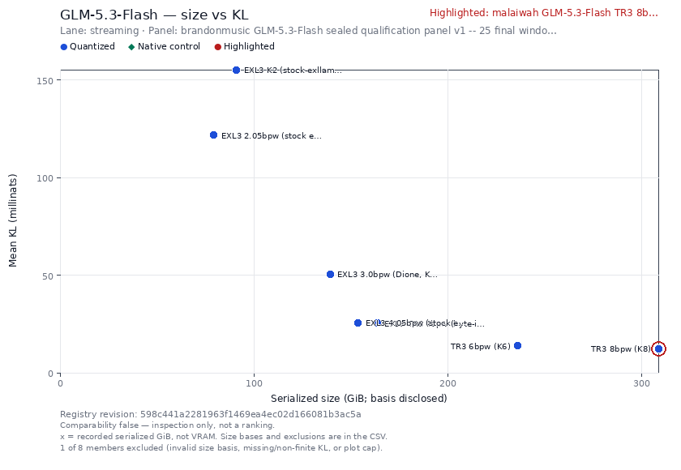

# GLM-5.3-Flash-TR3-8bpw (K8)

**The first 8-bit (K8) TR3/MCG trellis quantization of
[zai-org/GLM-5.3-Flash](https://huggingface.co/zai-org/GLM-5.3-Flash)** —
321B-total / A18B MoE, `glm5_next` hybrid architecture. Routed experts and the
MTP layer quantized at K8 (128-word trellis, MCG `0xCBAC1FED`); everything else
(KDA linear-attention layers, DSA indexer, hyper-connections, routers, norms,
embeddings, lm_head) **bit-exact native BF16**. 331.4 GB — within 1% of the
official FP8 release's footprint. Fidelity values below retain their own lanes.

<!-- QFS-SIZE-KL-BEGIN -->
## QFS size–fidelity evidence

[](https://malaiwah-qfs-explorer.hf.space/?tab=plots&measurement=measurement--glm53.k8-8bpw-stream.brandonmusic-final25&registry_revision=598c441a2281963f1469ea4ec02d166081b3ac5a&scale=auto)

The **panel25 streaming-lane** measurements: 25 windows, 51,175 scored positions, full-vocabulary KL(reference || candidate) in nats, with this artifact highlighted and its peers retained. K6 is plotted at **0.013714889 nats** and K8 at **0.012384191 nats**; these are the two-run streaming receipts, not K6's five-run sealed-ep8 result. Neither clean17 values nor cross-stack FP8 measurements are mixed into this plot.

This is **inspection-only, not a certified ranking**: the registry retains its scope, pipeline and missing-provenance limitations and draws no ranking line. The x-axis is recorded serialized bytes in GiB, **not VRAM**; K6/K8 use tensor-payload bytes while peers can use whole-repository bytes. The unquantized control has no recorded size, so it remains in the downloadable data with its exclusion reason rather than receiving an invented x-coordinate. No control subtraction is performed.

These are descriptive means on the historical panel: its 25 windows come from four source documents and include calibration-adjacent material. They do not establish population-level, native-serving or task-quality rankings; see the scope disclosures below.

[Interactive highlighted plot](https://malaiwah-qfs-explorer.hf.space/?tab=plots&measurement=measurement--glm53.k8-8bpw-stream.brandonmusic-final25&registry_revision=598c441a2281963f1469ea4ec02d166081b3ac5a&scale=auto) · [PNG](assets/qfs-glm53-k8-size-kl-panel25.png) · [SVG](assets/qfs-glm53-k8-size-kl-panel25.svg) · [CSV and exclusions](assets/qfs-glm53-k8-size-kl-panel25.csv) · [Full provenance JSON](assets/qfs-glm53-k8-size-kl-panel25.json) · [Live cached image](https://malaiwah-qfs-explorer.hf.space/plots/live.png?measurement=measurement--glm53.k8-8bpw-stream.brandonmusic-final25&scale=auto)

Registry snapshot: `598c441a2281963f1469ea4ec02d166081b3ac5a`. The static plot and data are stored with this card; the live image is explicitly mutable. No model weights or measurement values were changed by this plot addition.
<!-- QFS-SIZE-KL-END -->

## Quality — SEALED, full panel, two bitwise-identical cold runs

> ### ⚠ Scope disclosure — this number is a **panel25** number
>
> Added 2026-08-29. **Nothing here is a correction: 0.012384 is and remains the
> correct mean over the full 25-window panel.** What changed is that the panel is
> now known to contain calibration-adjacent windows, so the scope has to travel
> with the number.
>
> [brandonmusic](https://huggingface.co/brandonmusic/GLM-5.3-Flash-tr3-4bpw)
> ran a **13-gram overlap scan** of his sealed panel against its own
> calibration-role windows and found that the whole `axis4_reasoning` domain
> shares **37–39 %** of its 13-grams with calibration material — despite the
> panel being clean at the *document-hash* level. Document-hash dedup is not
> enough. He excluded that domain and scored his primary numbers on the **17
> windows that survive**. The finding, the scan and the 0.05 threshold are his.
>
> Every malaiwah number on this panel used all 25 windows, so every one of them
> carries the same contamination. Recomputed on his clean scope, from our own
> published per-window arrays (no GPU, no re-measurement — this is arithmetic on
> data already published):
>
> | | panel25 (published) | clean17 (his scope) | move |
> |---|---:|---:|---:|
> | **K8** | 0.012384 | **0.010829** | −12.55 % |
> | K6 sealed | 0.013723 | 0.011677 | −14.91 % |
> | K6 streaming | 0.013715 | 0.011676 | −14.87 % |
> | official FP8 | 0.020615 | 0.018665 | −9.46 % |
> | BF16 floor (cross-stack) | 0.012712 | 0.010648 | −16.24 % |
> | brandonmusic 4bpw | 0.024555 | 0.024949 | **+1.61 %** |
>
> **Correction, 2026-09-07.** The former 1.66×/1.72× FP8 quality ratios
> are withdrawn: those rows change runtime/lane as well as weights. The
> sealed-K6/streaming-K8 BCa contrast also mixes lanes. Same-lane
> K6stream−K8 means are 0.001331 (panel25) and 0.000847 (clean17),
> descriptive of the fixed panel, not general quantizer quality.
>
> **Statistical correction (2026-08-31, peer review P1-15).** This panel's 25
> windows derive from only **four source documents** (clean17: three), so
> window-level sign tests and intervals describe these exact windows rather
> than independent evidence. At the document level the K8-over-K6 contrast
> reads: all four (three) document means favour K8, exact sign test
> **p = 0.125** (panel25) / **0.25** (clean17) — the previously printed
> window-level p = 0.0041 / 0.049 are withdrawn as inferential statements. The
> ordering survives on this panel; a population claim awaits a panel with many
> independent documents per domain. **We will not restate "K8 is better than
> K6" without naming the scope — or beyond this panel.**
>
> **Do not difference a panel25 number against a clean17 one.** They are answers
> to different questions. Our registry enforces this structurally: `clean17` is
> its own derived panel with its own comparability key.
>
> The **excess-over-control** table below (formerly "quantization-attributable";
> renamed 2026-08-31, P1-05) cannot be recomputed on the clean scope — its floor
> is the *streaming* BF16 floor, whose receipt is scalar-only (run means and a
> tokenwise digest, no per-window array), and substituting the cross-stack floor
> would be the cross-lane subtraction our registry refuses. It stands as a
> panel25 number.
>
> Full recompute, with per-domain tables, paired intervals and provenance:
> [`reports/clean-scope-recompute.json`](https://huggingface.co/datasets/malaiwah/GLM-5.3-Flash-fidelity-suite-v1/blob/main/reports/clean-scope-recompute.json).
> Working: [PROTOCOL-ALIGNMENT.md](https://github.com/malaiwah/quant-fidelity-suite/blob/main/docs/PROTOCOL-ALIGNMENT.md) §4.
>
> **Padding correction, 2026-09-07.** The teacher's ~1.6e-8 padded mass is
> measured on real final-0000 logits; the ~1e-10 masking effect is from
> synthetic students, not this quant's full-panel logits. Sharing head
> weights does not imply equal hidden states or padded probability mass.
> The former `KLD × mass` equality and ninth-digit "masked equivalent"
> claim are withdrawn. Actual masked full-panel values remain unmeasured;
> published unmasked metrics and historical study receipts are unchanged.
> [`Study and correction`](https://github.com/malaiwah/quant-fidelity-suite/blob/main/docs/PROTOCOL-ALIGNMENT.md#3-divergence-1--the-padded-lm_head-columns).


**Mean KLD(teacher ‖ K8) = 0.012384191023436866** over the full sealed panel
(25 windows / 51,175 positions), **two cold runs producing identical means to
the last digit** (`bitwise_deterministic: true`). Quality gate passed.
Receipt: [`receipts/stream-k8-kld.json`](receipts/stream-k8-kld.json).

These raw values are a **mixed-design inventory, not a ranking**. Equal panel
identity is necessary; the actual pair predicate must also pass.

| Model | Mean KLD (nats) | Size | Lane |
|---|---:|---:|---|
| **This K8** | **0.012384** | 331 GB | streaming, 2 runs |
| [K6](https://huggingface.co/malaiwah/GLM-5.3-Flash-TR3-6bpw) | 0.013715 | 254 GB | streaming, 2 runs |
| K6 (sealed 8×H200, 5 runs) | 0.013723 | 254 GB | sealed EP8 |
| Official FP8 | 0.020615 | 328 GB | cross-stack |
| brandonmusic 4bpw | 0.024555 | 176 GB | his stack |
| 0xSero Dione Q4 | 0.027263 | 188 GB | [our measurement](https://huggingface.co/datasets/malaiwah/GLM-5.3-Flash-fidelity-suite-v1/blob/main/reports/dione-q4-packed-kld.json) |

Historical single-window diagnostic, **not comparable to the panel means**:

| Model | Mean KLD (nats) | Size | Lane |
|---|---:|---:|---|
| NVFP4 | 0.060535 | ~180 GB | his stack, 1 window |

**Correction, 2026-09-07.** The "1.66× closer" FP8 headline is withdrawn:
its runtime differs. K8 is 331 GB versus FP8's 328 GB and K6's 254 GB.
Separately, the sampled weight-space experiment found **13.2× lower NMSE**
for K8 (3.505e-5 vs 4.624e-4, 30/30 sampled matrices with the permutation
undone). Weight-space NMSE is not a serving-quality or whole-model proof.

**Lane disclosure.** Measured on the single-GPU *streaming* lane (~$6/model),
not the 8×H200 sealed lane. The lanes were bridged on this exact panel: K6
reads 0.013714889 streaming vs 0.013723385 sealed — **−8.5e-6 (0.06 %)**, with
the worst single window differing by 2.9e-4. The streaming receipt sets
`publishable_as_reproduction: false` because a different expert-combine order
is an independent measurement that agrees closely, not a bitwise reproduction.

**Single-window limitation.** On this panel, per-window KLD sd is 7.2e-3
(K6) / 6.9e-3 (K8), and paired K6−K8 sd is 2.0e-3 versus mean 1.33e-3.
The direction reversed on `window-0000`. A one-window result describes that
window, not a full-panel or population rate comparison; the full-panel
ordering is descriptive, not "decisive" independent-document inference.
[Historical investigation](https://github.com/malaiwah/quant-fidelity-suite/blob/main/engines/K8-ANOMALY.md).

### Excess over control (descriptive subtraction)

(Called "quantization-attributable error" before 2026-08-31; renamed per
peer-review P1-05 — the difference estimates excess divergence over the
same-lane unquantized control and is **not** a causal attribution.)

Scoring the **unquantized BF16 weights** against this teacher on this panel
already costs **0.011506 nats** — the price of the comparison itself (teacher
captured on a different runtime; bf16 addition is not associative across
differing expert-combine orders). Two cold runs, identical means. Subtracting it:

| | panel KLD | excess over control |
|---|---:|---:|
| BF16 (floor) | 0.011506 | — |
| K8 (331 GB) | 0.012384 | **0.000878** |
| K6 (254 GB) | 0.013715 | **0.002209** |

K8's residual is smaller than K6's — 0.000878 vs 0.002209 nats — where the raw
means sit only 1.11x apart, because the floor is common to both rows and
dominates both. **The previously published ratio of the two residuals
("2.52x") is withdrawn**: a ratio of small residuals magnifies control error
and carried no uncertainty. Read the residuals beside the raw values, with the
floor named. Method, receipts and the ways this subtraction can be misused:
[BF16-FLOOR.md](https://github.com/malaiwah/quant-fidelity-suite/blob/main/engines/BF16-FLOOR.md).

## What this is (and is not)

- **Codec:** EXL3-format TR3/MCG trellis (turboderp's
  [exllamav3](https://github.com/turboderp-org/exllamav3) kernels @ `c5d9c657`),
  through [brandonmusic's GLM-5.3 pipeline](https://github.com/brandonmmusic-max/glm-5.3-flash-exl3-4bpw)
  with a disclosed patch series. His published core admits K3/K4/K5, so **K8 is
  a declared rate extension** — our encoder was verified **byte-identical** to
  his sealed core across 120 encodes / 624 MiB / 0 differing bytes
  ([evidence](https://github.com/malaiwah/quant-fidelity-suite/blob/main/engines/fallback/closure-comparison.json),
  [issue #1](https://github.com/brandonmmusic-max/glm-5.3-flash-exl3-4bpw/issues/1)).
  This establishes sampled codec equivalence, not every historical campaign
  matrix or native decode/forward equivalence.
- **Serving runtime:** use
  [`malaiwah/glm52-exl3-vast`](https://github.com/malaiwah/glm52-exl3-vast)
  with `MODEL_PROFILE=glm53-k8`. The image pins the qualified Glm5Next vLLM,
  B12X sparse-attention stack, native EXL3 K8 extension, CUDA, and fail-closed
  runtime overlays as one contract.
- **Not stock exllamav3/TabbyAPI or stock upstream vLLM:** those stacks do not
  carry this complete `glm5_next` + TR3/MCG K8 serving path.
- **Topology-neutral checkpoint:** canonical unsharded tensors; TP layout is a
  load-time decision. The qualified deployment is exactly TP4/DCP4 on four
  96 GiB RTX PRO 6000 Blackwell GPUs.
- **Measured memory:** the packaged runtime loads 76.31 GiB of model tensors per
  rank. At GMU 0.93, profiling reported 78.94–78.97 GiB weights + non-torch,
  2.25 GiB peak activations, zero CUDA-graph memory, and 7.10–7.14 GiB KV per
  GPU.
- **Parts-bin sibling:** encoded with the **same transform seed and calibration
  as [K6](https://huggingface.co/malaiwah/GLM-5.3-Flash-TR3-6bpw)**, so the two
  per-choice payload stores are mix-and-matchable — a K6K8 multi-precision build
  (e.g. K8 on `down_proj`, K6 on gate/up) is **offline CPU assembly, no GPU
  re-encode**. The parts bin is published: [GLM-5.3-Flash-TR3-partsbin-v1](https://huggingface.co/datasets/malaiwah/GLM-5.3-Flash-TR3-partsbin-v1).
  Assembly does not reproduce a fresh encode with down-projection Hessians
  conditioned on the mixed gate/up choice; the mixed artifact needs its own
  fidelity measurement.

## Provenance & disclosed deviations

Pins: BF16 source `zai-org/GLM-5.3-Flash-BF16` (weights == `a6c167b6`);
calibration = brandonmusic's published EP4 captures (sealed inventory
`f56e9d62…` adopted verbatim). Deviations, all receipted: encoded on 4×H200
SM90 (his campaign attests 4×B200 SM100; fat `9.0;10.0` extension build), K4-KL
gate satisfied via a disclosed bridge document carrying his real published K4
receipt hashes, measurement on the streaming lane at EP8 emulation with fp32
combine order. Materialization receipt: bits 8, `complete`,
`main_and_mtp_complete`, `nonrouted_native_exact`, 331,449,761,784 logical
bytes, 37,152 routed choices, 1,618 native tensors.

## Lineage on the Hub

Z.ai published two sibling roots for this model and neither declares the other:
[`zai-org/GLM-5.3-Flash`](https://huggingface.co/zai-org/GLM-5.3-Flash) (the
**FP8** release, where most traffic lands) and
[`zai-org/GLM-5.3-Flash-BF16`](https://huggingface.co/zai-org/GLM-5.3-Flash-BF16)
(the **BF16** weights). This quant declares BF16 as its `base_model` because
that is what it was actually quantized from — the FP8 release is a *sibling*
quantization of the same model, not our source, and it is the baseline we
measure against rather than build on. Quants that list FP8 as their base were
genuinely made from the FP8 weights; the trees differ for real reasons.

Related work on the same model, all measured on one panel in the
[quant-fidelity registry](https://huggingface.co/datasets/malaiwah/quant-fidelity-registry):
[brandonmusic 4bpw](https://huggingface.co/brandonmusic/GLM-5.3-Flash-tr3-4bpw),
[0xSero Dione Q4](https://huggingface.co/0xSero/GLM-5.3-Flash-EXL3-Q4),
[orcarouter MLX](https://huggingface.co/orcarouter/GLM-5.3-Flash-MLX).
Collection: [GLM-5.3-Flash — measured quants & fidelity](https://huggingface.co/collections/malaiwah/glm-53-flash-measured-quants-and-fidelity-6a91f253e7107818359f37c8).

## Credits

Base model by [Z.ai](https://huggingface.co/zai-org). Quantization pipeline,
calibration captures, and teacher panel by
[brandonmusic](https://huggingface.co/brandonmusic) — co-credited, see the
[collaboration thread](https://huggingface.co/brandonmusic/GLM-5.3-Flash-tr3-4bpw/discussions/1).
Trellis codec and kernels by [turboderp](https://github.com/turboderp-org/exllamav3).
Every tool, patch, receipt and the full campaign log:
[malaiwah/quant-fidelity-suite](https://github.com/malaiwah/quant-fidelity-suite).
Comparable measurements across quants:
[quant-fidelity-registry](https://huggingface.co/datasets/malaiwah/quant-fidelity-registry).

## Serving — live-qualified turnkey profile

### Qualification result

The shipped profile is **`glm53-k8`**. It was booted on 4× RTX PRO 6000
Blackwell 96 GiB and passed arithmetic, factual, instruction-following, strict
structured-output, and tokenizer-exact 32K retrieval startup gates. The final
published image was then pulled by digest and smoke-tested without source or
runtime-overlay mounts.

- Appliance source commit: [`a0d05f76994cf44f3667c0d2910d3b0e4d305d23`](https://github.com/malaiwah/glm52-exl3-vast/commit/a0d05f76994cf44f3667c0d2910d3b0e4d305d23)
- Checkpoint revision: `b5ef443adce36ba5a10f2d5aa682fc9f2f0d0fae`
- Qualified parent: `verdictai/glm53-flash-exl3-k4@sha256:0f1cdcc8891f1cc3a444121eb61d366289a1cbba285f0892dcbb24bc94961692`
- Published appliance: `ghcr.io/malaiwah/glm52-exl3-vast@sha256:5a0d4b370e9f6a2ef85fa8b8c213492122554b34ba18d630a3a78130758914cf`
- Shape: TP4 / DCP4 A2A, B12X sparse MLA, Triton MoE, native EXL3 K8,
  calibrated NVFP4-DS MLA KV, MTP off, eager mode, batch 512, C8, GMU 0.93
- Request limit: **458,752 tokens**; text-only qualification scope

### Why K8 uses the native eager path

The eight overlapping 16-bit MCG windows for K8 span 72 bits, while B12X's
fused EXL3 decoder represents that state in two 64-bit words. The runtime
therefore fails closed instead of merely widening the fused decoder's bitrate
guard. This profile uses ExLlamaV3's compiled native K8 extension and passes the
actual uniform layer bitrate into the K8 dispatch. `VLLM_EXL3_PREFILL_CAPACITY`
is bounded to the scheduler's 512-token batch and eager mode avoids an
unqualified graph path. B12X sparse MLA and the rest of the qualified GLM-5.3
stack remain enabled.

The engine exposed **6,610,733 logical KV tokens**, or 14.41 maximum-length
requests. Per-GPU profiling reported 78.94–78.97 GiB weights plus non-torch,
2.25 GiB peak activations, zero graph memory, and 7.10–7.14 GiB KV.

### Correctness and context

Two independent 448K trials each built a tokenizer-exact 449,461-token document
and retrieved all three facts, in 170.775 and 175.086 seconds. Short and strict
structured-output checks still passed after the long-context stress. The common
458,752-token K6/K8 cap is a correctness boundary, not an extrapolation from KV
capacity.

### Measured throughput

Unique-prefix prefill, one request, no prefix reuse:

| prompt | tok/s |
|---:|---:|
| 8K | 2,684 |
| 32K | 2,825 |
| 64K | 2,938 |
| 128K | 2,986 |

Aggregate target-only decode (`MTP_TOKENS=0`), eight requests per level:

| input context | C1 tok/s | C4 tok/s | C8 tok/s |
|---:|---:|---:|---:|
| 256 | 10.29 | 38.79 | 75.66 |
| 32K | 8.42 | 23.43 | 28.46 |
| 128K | 5.42 | 12.05 | 13.25 |

All 72 requests completed without failure, preemption, or prefix reuse. These
are measurements from one four-GPU PCIe host, not guarantees for other topology,
clock, thermal, driver, storage, or request mixes.

### K8 versus the K6 production default

K8 lowers panel KLD from K6's 0.013723 to 0.012384. After subtracting the common
BF16/runtime floor, its excess over control is 0.000878 nats against K6's
0.002209 (no residual ratio is quoted — P1-05). The
cost is about 77 GB / 30% more checkpoint bytes, about 15.2 GiB more non-KV
memory per GPU, and about 14.4 GiB less KV per GPU. K6 is 5.3–7.3× faster at
short context and 8.3–24.4× faster when the measured 32K/128K prefill cost is
included. K8 is the fidelity-first option; K6 remains the production default.

### Docker Compose

Prerequisites: Linux x86-64, four visible RTX PRO 6000 Blackwell GPUs, NVIDIA
driver ≥ 590.48.01 / CUDA 13.2 compatibility, the NVIDIA Container Toolkit,
and roughly 400 GiB free persistent storage for the checkpoint plus caches.
PCIe P2P on this card family requires NVIDIA's open kernel modules; see the
[RTX 6000 Pro multi-GPU notes](https://github.com/brandonmmusic-max/rtx6kpro).

```yaml
name: glm53-k8
services:
  api:
    image: ghcr.io/malaiwah/glm52-exl3-vast@sha256:5a0d4b370e9f6a2ef85fa8b8c213492122554b34ba18d630a3a78130758914cf
    pull_policy: always
    restart: unless-stopped
    network_mode: host
    ipc: host
    shm_size: 32gb
    stop_grace_period: 2m
    ulimits:
      memlock:
        soft: -1
        hard: -1
    environment:
      MODEL_PROFILE: glm53-k8
      AUTH: key
      VLLM_API_KEY: ${VLLM_API_KEY:?set VLLM_API_KEY to a long random secret}
      HF_TOKEN: ${HF_TOKEN:-}
      SSH_ENABLED: "0"
      SOUL_ENABLED: "0"
      VERIFY_HEALTH_TIMEOUT_S: "3600"
    volumes:
      - /srv/glm53-turnkey:/workspace
      - /srv/glm53-cache:/cache
    deploy:
      resources:
        reservations:
          devices:
            - driver: nvidia
              count: 4
              capabilities: [gpu]
```

```bash
sudo mkdir -p /srv/glm53-turnkey /srv/glm53-cache
export VLLM_API_KEY="$(openssl rand -hex 32)"
docker compose up -d
docker compose logs -f
```

First boot downloads about 309 GiB and can take substantial time. The container
is ready only after the log reports `>>> Verified: serving; long-context
retrieval verified`. API: `http://HOST:8000/v1`; dashboard:
`http://HOST:1111`. The served model name is `GLM-5.3-Flash-K8`.

```bash
curl http://127.0.0.1:8000/v1/chat/completions \
  -H "Authorization: Bearer $VLLM_API_KEY" \
  -H "Content-Type: application/json" \
  -d '{"model":"GLM-5.3-Flash-K8","messages":[{"role":"user","content":"Reply with exactly READY"}],"max_tokens":256}'
```

Do not replace only the checkpoint path in another vLLM command. The profile,
parent digest, runtime overlays, quantization, attention backend, DCP topology,
KV calibration, scheduler, and eager execution mode are one qualified contract.
